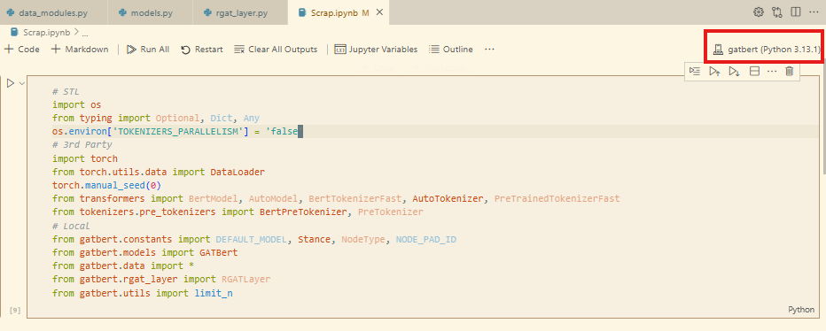

# Hipergator Setup

I recommend at least reading through [bash-basics](../bash-basics) first, even if you don't do the exercises.

## Blue and Orange Directories
You should store as little in your `/home/<username>` directory as possible, because you have a 30GB quota for that.
HPG offers blue and orange disk storage, and our lab at least as fairly high quotas.

Make symbolic links to them in your home directory, as that will make things easier for you:
```bash
cd ~
ln -s /blue/bonniejdorr/$(whoami) blue_dir
ln -s /orange/bonniejdorr/$(whoami) orange_dir
```
In general, only use orange storage for files you aren't going to look at for a while (like model checkpoints from past experiments).

A lot of applications will store data under your home directory by default.
Here's how to change the defaults for a few common ones we use:
```bash
# Natural Language Toolkit's data downloads
echo 'export NLTK_DATA=$HOME/blue_dir/datasets/nltk_data' >> ~/.bashrc
# Hugging face's downloads
echo 'export HF_HOME=$HOME/blue_dir/huggingface' >> ~/.bashrc
# Apptainer's caches
echo 'export APPTAINER_CACHEDIR=$HOME/blue_dir/apptainer_cache' >> ~/.bashrc
# Pip's caches
echo 'export PIP_CACHE_DIR=$HOME/blue_dir/pip_cache' >> ~/.bashrc
```

Conda is a bit more complicated as you need to change some command config files.
Add the following lines to your `~/.condarc` file:
```bash
pkgs_dirs:
  - /home/<type your username>/blue_dir/conda/pkgs
env_dirs:
  - /home/<type your username>/blue_dir/conda/envs
```
These lines were drawn from HPG's [excellent documentation](https://help.rc.ufl.edu/doc/Managing_Python_environments_and_Jupyter_kernels).

To check your (and the lab's) usage of the various storage directories, run the following commands:
```bash
home_quota
blue_quota
orange_quota
```

## VS Code Development
If you haven't already, make an account on [github.com](github.com), as it's an easy way to do authentication for remote development with VSCode.

Download the "CLI x64" version of VSCode from [here](https://code.visualstudio.com/Download) then upload it to Hipergator:
```
scp vscode_cli_alpine_x64_cli.tar.gz <user name>@hpg.rc.ufl.edu:~/
```

On hipergator, unzip it:
```bash
unzip vscode_cli_alpine_x64_cli.tar.gz
./code --help
```

Make special directories on your blue storage for VSCode to save extra data:
```
cd ~
mkdir -p blue_dir/vscode-server/data
mkdir -p blue_dir/vscode-server/extensions
```

I frequently like to spin up a slurm job with a GPU, so I can interactively run code in VSCode with a GPU backend.
Let's say this is my slurm job run_vscode.sh:
```bash
#!/bin/bash

#SBATCH --partition=gpu
#SBATCH --gres=gpu:a100:1
#SBATCH --time=12:00:00
#SBATCH --job-name=a100_vscode
#SBATCH --nodes=1
#SBATCH --ntasks=1
#SBATCH --cpus-per-task=8
#SBATCH --mem=16gb

BLUE_DIR=/home/<your username>/blue_dir
./code tunnel --extensions-dir $BLUE_DIR/vscode-server/extensions --server-data-dir $BLUE_DIR/vscode-server/data
```

After submitting the job, refer to the [HPG staff's instructions](https://help.rc.ufl.edu/doc/VS_Code_Remote_Development#:~:text=Connect%20To%20The%20Tunnel) for authenticating.

Once you have VSCode brought up, make a conda environment from a conda file like this one:
```yml
name: my_env
dependencies:
  - python>=3.10
  - ipykernel
  - numpy
```
The key is that `ipykernel`; you need that package in your Python environment for it to integrate with Jupyter.

- Install the Jupyter VSCode extension by searching for "Jupyter" from the extensions menu.
- Make a new `MyNotebook.ipynb` file and open it
- Click the kernel-select button in the top-right corner
- From the drop-down menu, search for your environment by Selecting "Select Another Kernel > Python Environments" and search for "~/blue_dir/conda/envs/..."


