# Using External Storage

Zotero's free cloud storage tier only offers 300 MB.
University of Florida on the other hand offers 5TB to every student on OneDrive.

This guide has been adapted from UC BCJ's [excellent guide](https://guides.lib.berkeley.edu/zotero/zotfile).

1. Ensure you have Zotero 7 or newer installed.

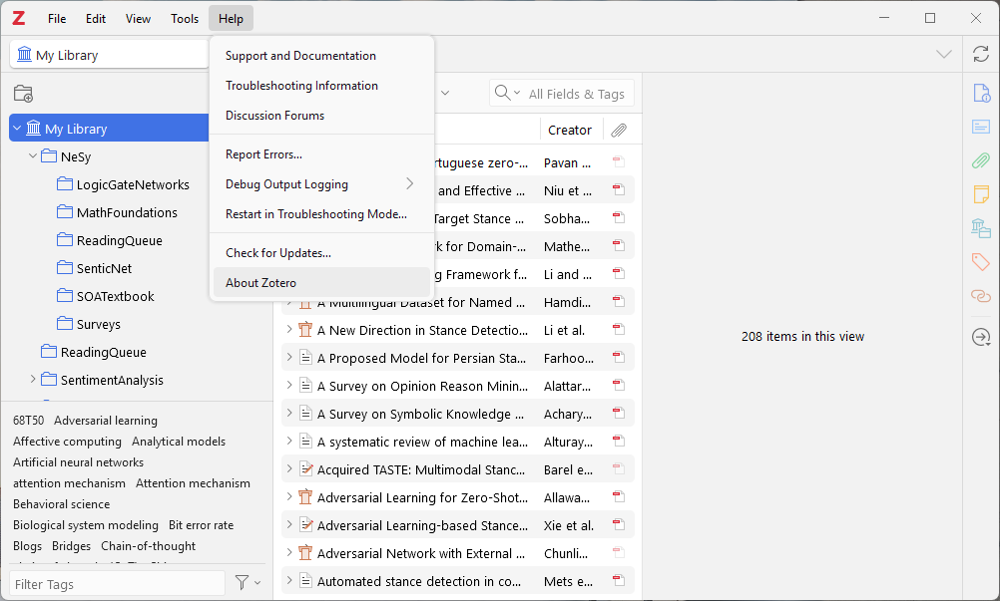

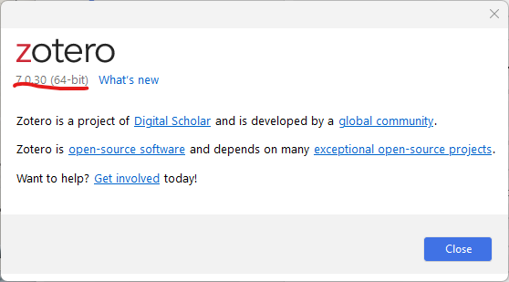

2. If you already have the OneDrive sync app installed, make sure it's not the [deprecated One Drive Business sync app](https://learn.microsoft.com/en-us/sharepoint/transition-from-previous-sync-client). If it is, uninstall it.
3. Install the [latest version of OneDrive](https://www.microsoft.com/en-us/microsoft-365/onedrive/online-cloud-storage#Download-the-app) if you don't have it already.
4. Find the OneDrive icon in your system tray and click it to open the OneDrive app. If it's not there, search for it in the Search bar and start it from there.

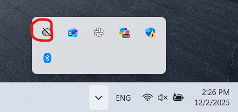

5. Click the "Sign in" button and sign in with your UF credentials.

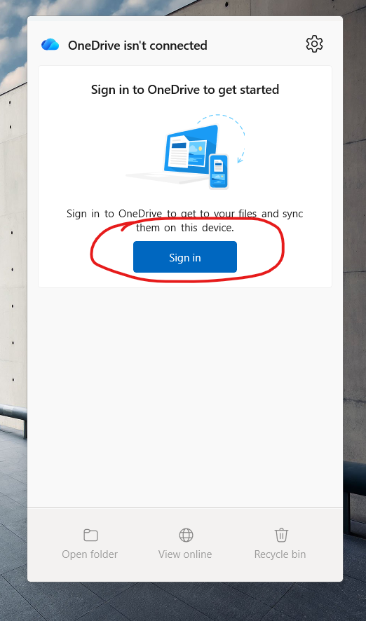

I personally prefer to specify which apps are tied to my UF credentials specifically:

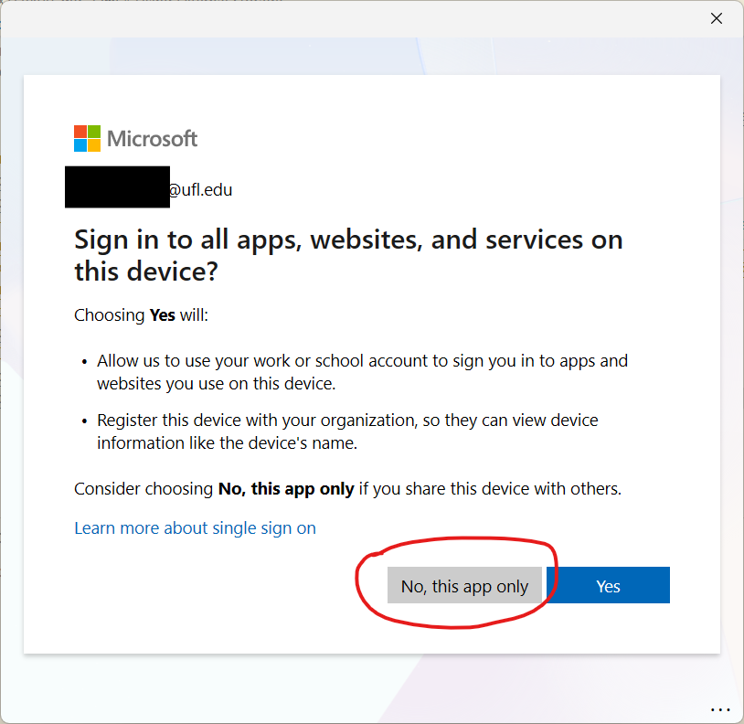

I also prefer to not backup more than what I need to, so I uncheck these:

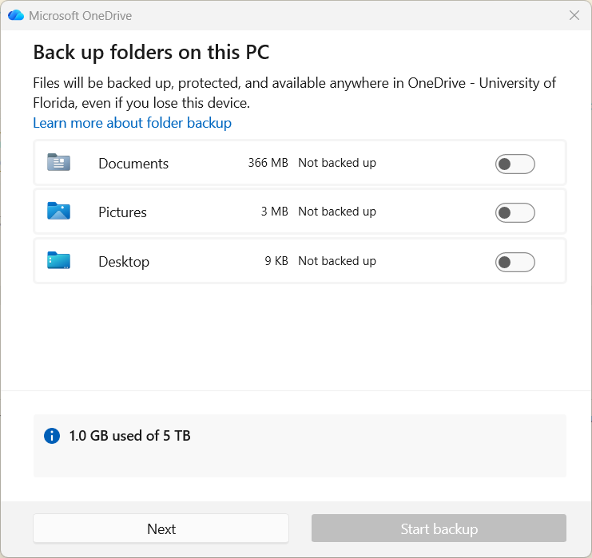

6. Navigate to your UF OneDrive folder and create a new folder called "Zotero".

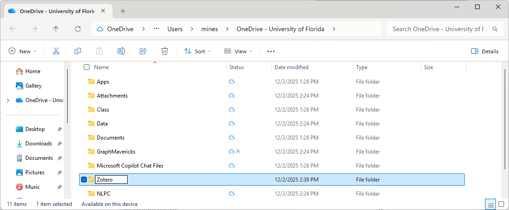

7. Download the latest release of the [ZotMoov](https://github.com/wileyyugioh/zotmoov) plugin

8. Install the plugin in Zotero

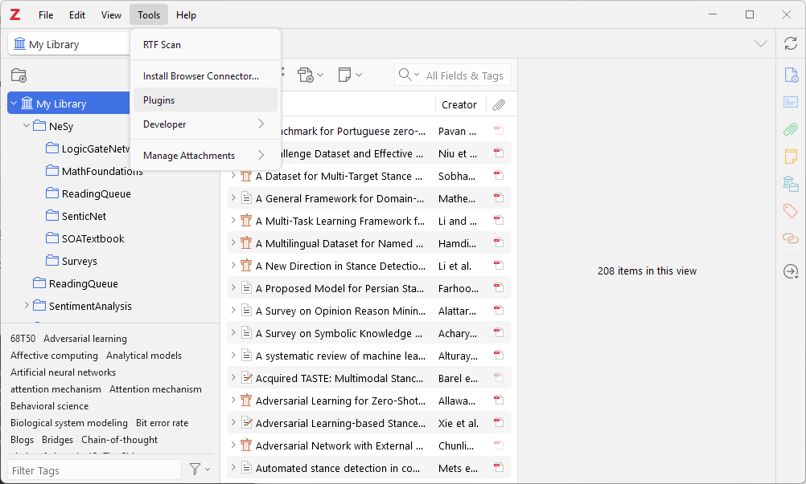

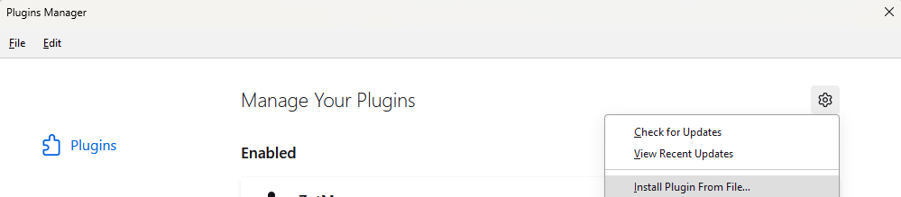

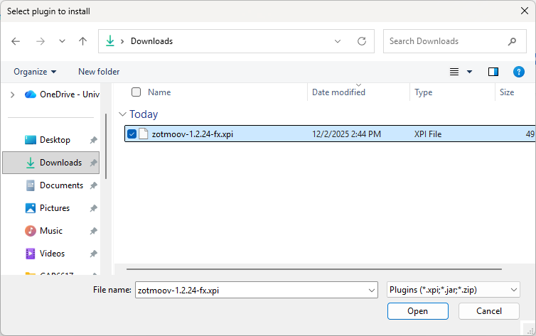

9. Update Zotero to no longer sync the PDFs in your personal library to their cloud. Retain syncing for group libraries (ZootMoov only supports your personal library).

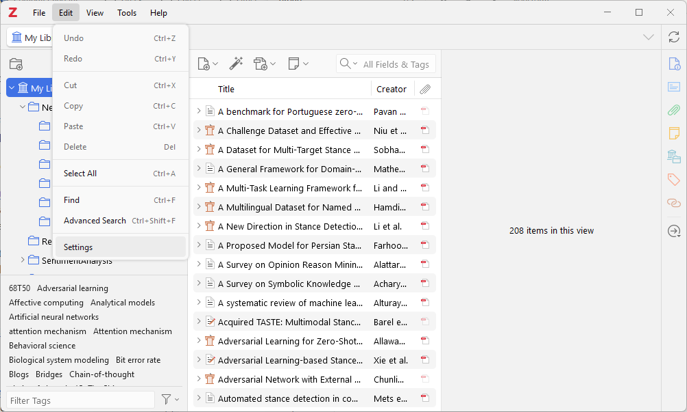

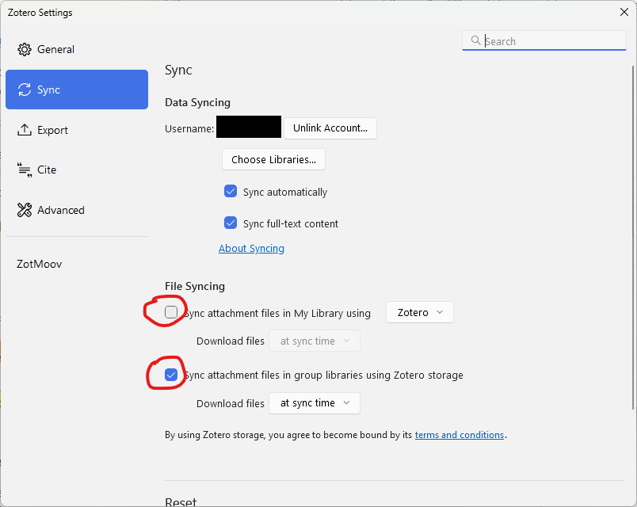

10. Use the ZootMoov settings to use your `OneDrive/Zotero` folder as your external storage location. Match my `Other Settings` as well.

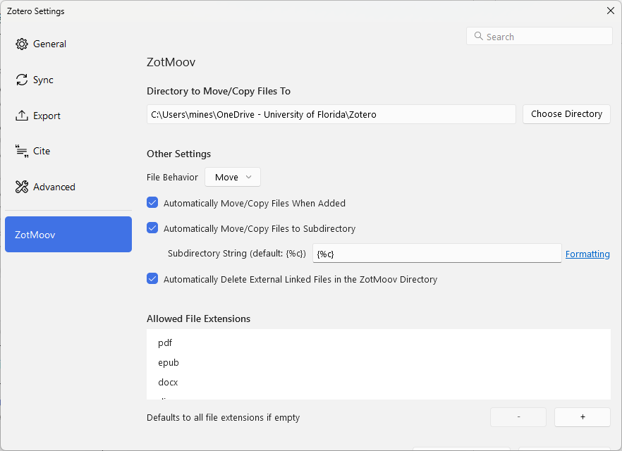

11. Go to your library root. Hit Ctrl+A to select all the files, right-click to bring up the context menu, and move all of your PDFs to ZootMoov's folder.

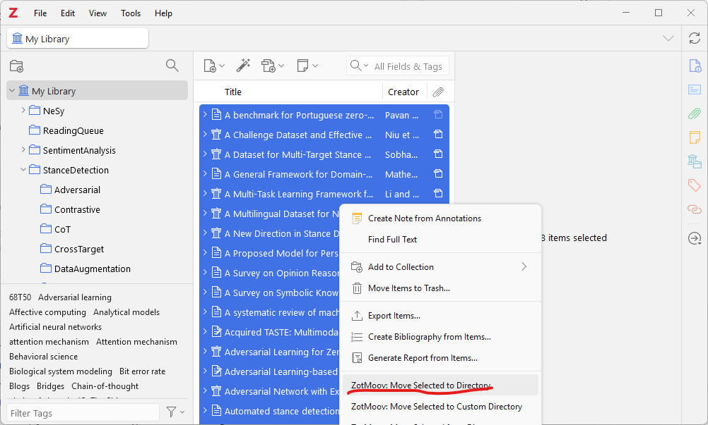

12. Your OneDrive folder should roughly match the directory structure of your Zotero library (note that if you have an article stored in more than one subdir under Zotero, it will only show up in one of those subdirs here).

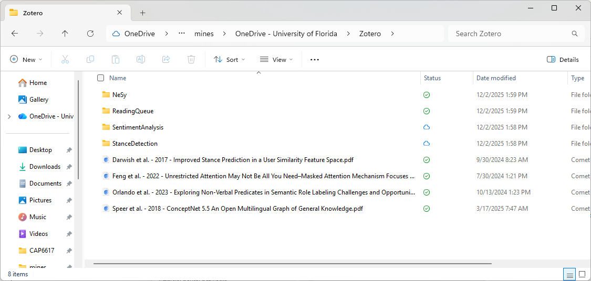

13. Hit sync in Zotero to make sure your PDFs are removed from the cloud.

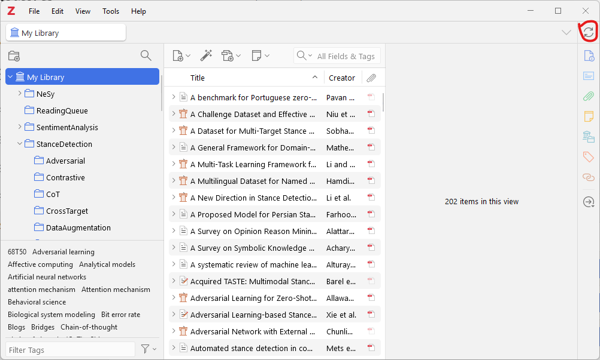

14. Go to [https://www.zotero.org/settings/storage?ref=usb](https://www.zotero.org/settings/storage?ref=usb) and check your storage usage. Between my papers' metadata and notes, my usage is in the MBs:

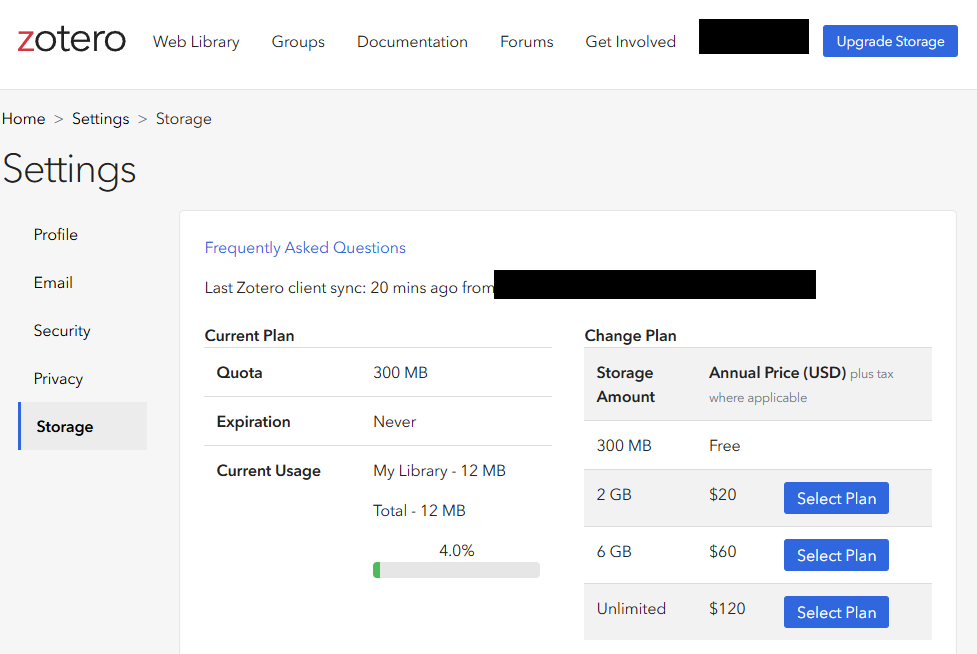
