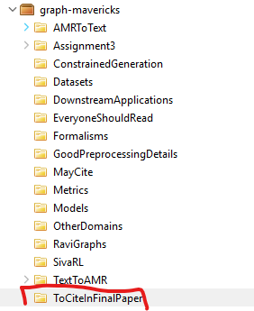
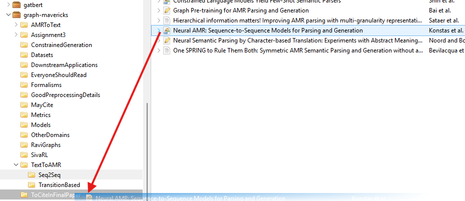
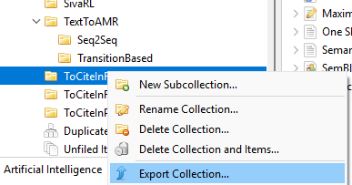
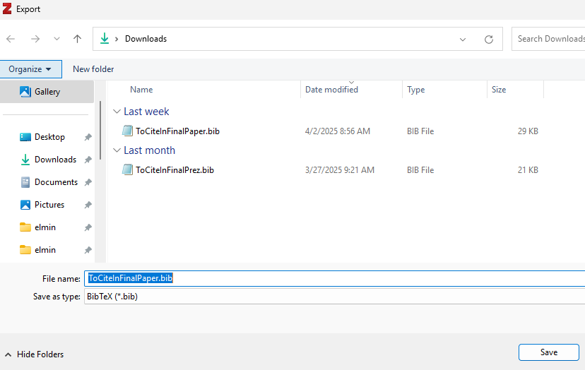
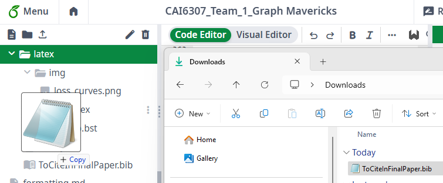
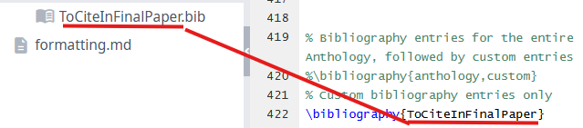
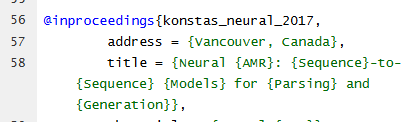
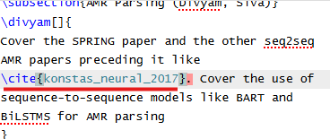

# Zotero

## Adding Citations to Overleaf

1. Make a folder where you intend to copy all your sources for your paper (you can have one paper in multiple folders in Zotero)

2. Drag the papers you want to that folder

3. Export that folder as a BibTex file

4. If you've already done this process before, and you're re-generating the .bib file, make sure you use the same file name each time

5. Upload the generated .bib file to your Latex project. If you've done this process before, make sure you upload it to the correct subdirectory and overwrite the old file

6. Make sure your main Latex doc is importing the .bib file appropriately.

7. Find the source you added in the .bib file you want to reference

8. Add the appropriate citation in the text.

